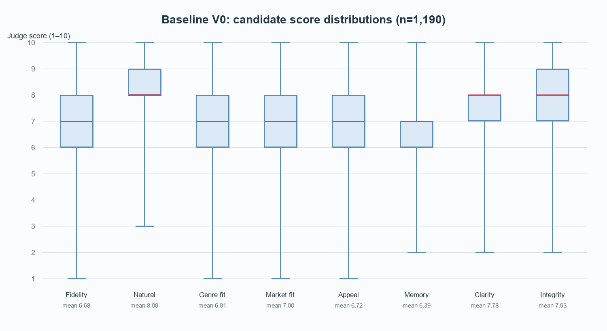
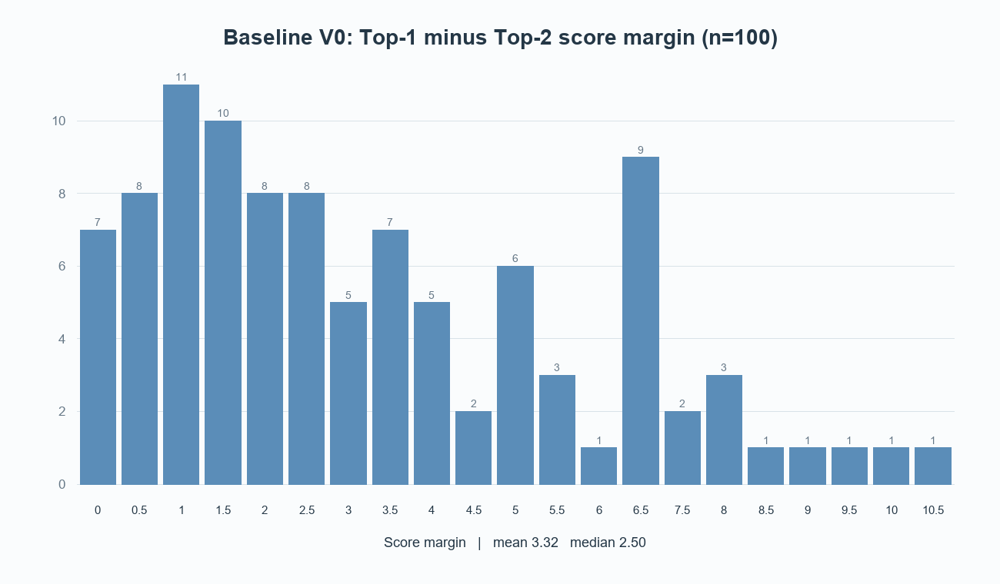
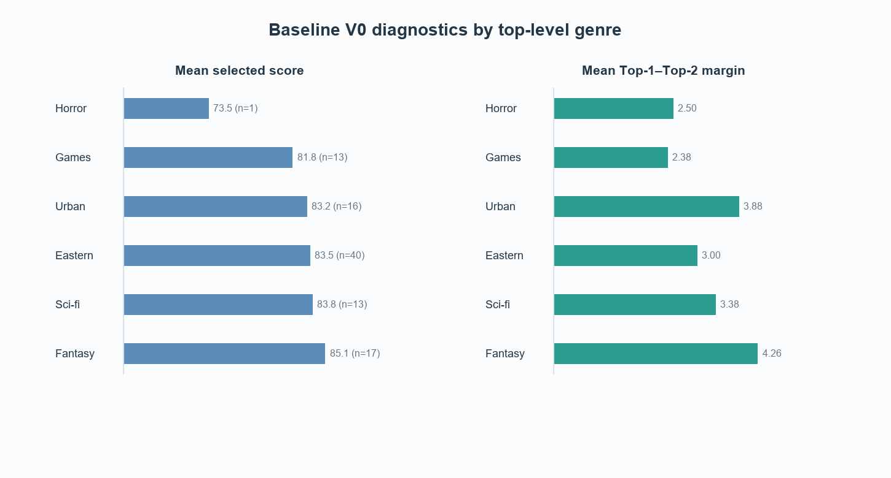

# Baseline V0：Prompt 多策略生成 + 八维绝对评分 + 加权 Top 1

> **Baseline ID：** `baseline_v0_weighted_score`  
> **报告日期：** 2026-08-08  
> **结果文件：** `output/novel_pairs_100_title_localizations.csv`  
> **结论性质：** 运行、平台发布标题精确一致与评分器内部诊断；尚不是完整人工质量评测

> **术语说明：** 本报告中的 `en_title` / `published_target_title` 是
> **Published Title / Platform Anchor / Weak Positive**。它表示平台实际采用过的标题，
> 不是绝对 Ground Truth、唯一正确译名或真实读者商业偏好的直接证据。

## 摘要

本轮对 100 部中英网文标题配对执行了两阶段流程：先按 3 种策略生成目标为 12 个的英文候选，再由同一模型按 8 个维度进行绝对评分，并用固定权重计算总分、选择 Top 1。CSV 共保存 1,190 条候选记录。

本轮最可靠的结论有五点：

1. **请求层运行成功，但候选完整性不是 100%。** 100/100 个样本标记为 `success`，其中 99 个有 12 个候选；《我的一天有48小时》只有 2 个候选，因此完整候选集率为 99%，平均候选数为 11.9。
2. **加权计算与选择逻辑一致。** 1,190 条候选的 CSV 总分均可由 8 个维度及配置权重精确复算，Top 1 与 `selected_candidate_id` 的一致率为 100%。
3. **平台发布标题精确复现率较低。** 以原始 JSONL 的 `en_title` 为 Platform Anchor，规范化精确匹配的 Published-title Top-1 Agreement 为 4%，Published-title Hit@3 为 5%，候选池 Hit@Any 为 10%。
4. **绝对分数还不能证明非平台发布标题候选的真实质量。** Top 1 平均自评分为 83.47，但目前没有独立人工标签、重复判分或顺序扰动结果，不能把该自评分解释为质量准确率或人工接受率。
5. **下一轮应先验证评分稳定性。** 7/100 个样本的第一、第二名同分，26/100 的分差不超过 1 分；这些样本的最终选择较依赖 tie-break 规则，适合优先进入顺序扰动与 Pairwise/Listwise 对照实验。

---

## 1. 数据说明

### 1.1 输入与结果

| 项目 | 本轮记录 |
| --- | --- |
| 样本数 | 100 部作品 |
| 候选记录数 | 1,190 条 |
| 输入数据 | `data/processed/novel_pairs/100/novel_pairs_100.jsonl` |
| 输入 SHA-256 | `3275317D63950313DF2650CA11301E0E1EEA71DB2F22A444C1B6936AD0BD34B3` |
| 结果数据 | `output/novel_pairs_100_title_localizations.csv` |
| 结果 SHA-256 | `FEEB1B6E0E0299AC4132660B1856D1B0EDEEC65A4475407ECBFAD686C30C566F` |
| 源语言 / 目标语言 | `zh-CN` / `en-US` |
| 顶层题材分布 | Eastern 40、Fantasy 17、Urban 16、Games 13、Sci-fi 13、Horror 1 |
| 平台发布英文标题 | 原始 JSONL 的 `en_title`；作为 Platform Anchor / Weak Positive，不作为 Ground Truth |

经逐条核对，JSONL 的 100 个 `pair_id` 与 CSV 的 100 个 `sample_id` 完全对应，`en_title` 与 `published_target_title` 也是 100/100 完全一致，0 缺失、0 额外、0 字段不一致。因此 CSV 的 `published_target_title` 可直接用于平台发布标题复现指标，但不能据此定义标题质量真值。

CSV 是“每个候选一行”的长表，保留了样本信息、平台发布标题、最终选择、候选排名、候选总分和 8 个原始维度分。这已经适合离线重算权重，但仍缺少生成策略、Prompt 版本、模型、原始响应、时延、Token 和成本等逐条 provenance 字段。

### 1.2 数据切分状态

本轮 CSV 中没有 `split` 字段，而且 100 条结果已被全量运行和分析。因此这批数据归入 Pilot / Early Development Data，不能再被追溯性地命名为 Frozen Test Set，也不能视为未触碰测试集上的正式泛化结果。

后续应从未影响 Prompt、规则、标签或模型决策的数据中，另外保留 100 条 Frozen Test Set，并将 split manifest 单独版本化。正式版本可以按预先声明的协议运行，但测试结果只用于版本比较和最终报告，不能回流到 Prompt、权重、阈值、Hard Negative、模型或 checkpoint 选择。

---

## 2. 系统流程

```text
作品标题 + 中文简介 + 题材
  -> 3 种 Prompt 策略生成候选
  -> 候选清洗与约束检查
  -> 8 维绝对评分
  -> 固定权重重算总分
  -> 按总分及 tie-break 规则排序
  -> 输出 Top 1 与完整候选长表
```

本轮候选生成与评分发生在同一条 API 流程中，但报告分析严格区分两类问题：

- 生成器问题：候选不足、候选重复、候选池覆盖面不足；
- 评分器问题：维度区分度、同分、顺序敏感性、与人工偏好不一致。

---

## 3. Prompt 与评分维度

### 3.1 生成 Prompt

配置中包含三种候选生成策略：

| 策略 | Prompt 版本 |
| --- | --- |
| 基于源标题 | `source-title-v2` |
| 基于简介 | `synopsis-v2` |
| 面向市场本地化 | `market-localized-v2` |

目标候选数为每条 12 个。本轮 99 条达到目标，1 条只返回 2 个候选。CSV 未保存每个候选对应的生成策略和生成顺序，因此目前不能比较三种策略各自的贡献、重复率或入选率。

### 3.2 八维评分与权重

| 评分维度 | 权重 | 全部候选均值 | 全部候选标准差 | Top 1 均值 |
| --- | ---: | ---: | ---: | ---: |
| 语义忠实度 `semantic_fidelity` | 20% | 6.68 | 1.59 | 8.44 |
| 英文自然度 `natural_english` | 15% | 8.09 | 0.95 | 8.79 |
| 题材与基调适配 `genre_tone_fit` | 10% | 6.91 | 1.33 | 8.07 |
| 目标市场适配 `target_market_fit` | 10% | 7.00 | 1.20 | 8.17 |
| 读者吸引力 `reader_appeal` | 15% | 6.72 | 1.30 | 8.10 |
| 记忆点与辨识度 `memorability_distinctiveness` | 10% | 6.39 | 1.28 | 7.52 |
| 清晰与简洁 `clarity_concision` | 10% | 7.78 | 1.03 | 8.58 |
| 真实性与安全 `integrity_safety` | 10% | 7.93 | 1.45 | 8.91 |

总分公式为：

```text
weighted_score = Σ(dimension_score × dimension_weight / 10)
```

权重合计 100，最终总分范围为 0–100。本轮 1,190 条记录的复算误差均为 0。



英文自然度、清晰简洁和安全性整体偏高，记忆点与语义忠实度均值相对较低。该分布说明维度并非全部挤在同一分段，但也提示不同维度的评分尺度可能不完全一致；是否属于评分器偏差，需要通过重复判分和人工标签验证。

---

## 4. 实验配置

| 配置项 | 本轮可确认值 | 复现状态 |
| --- | --- | --- |
| Run ID | `baseline_v0_weighted_score` | 本报告补充命名，原 CSV 无 `run_id` |
| 生成策略数 | 3 | 已由配置确认 |
| 目标候选数 | 12 | 已由代码与结果确认 |
| 生成 temperature | 0.7 | 已由配置确认 |
| 生成最大尝试次数 | 3 | 已由配置确认 |
| 评分最大尝试次数 | 2 | 已由配置确认 |
| 评分 Prompt | `eight-dimension-score-v2` | 已由配置确认 |
| Rubric | `title-rubric-v1` | 已由配置确认 |
| 权重版本 | `default-weights-v1` | 已由配置确认 |
| 候选排列 seed | `20260729` | 已由配置确认 |
| tie-break | 总分、忠实度、安全性、自然度、candidate_id | 已由配置确认 |
| 模型名称 | **本轮结果未记录** | 配置默认值是 `gpt-4.1-mini`，但不能据此断言实际运行模型 |
| top_p | 未设置 / 未记录 | 待补 |
| 最大输出 Token | 配置默认 16,000 | 实际运行解析值未写入结果 |
| 超时 | Provider 配置默认 60 秒；批处理脚本默认 180 秒 | 实际命令行参数未记录 |
| 原始模型响应 | 未保留在 CSV | 待补 |
| 单条时延 / Token / 成本 | 未记录 | 待补 |
| 运行时 Git commit | 未记录 | 当前检查时仓库为 `8808f58`，不能反推为本轮 commit |
| 结果文件时间 | 2026-08-06 23:02:53（Asia/Shanghai 文件时间） | 可确认文件生成/修改时间，非完整运行日志 |

当前配置足以复算分数，但不足以完全重放生成与判分过程。下一次正式运行应先写入 `runs.jsonl`，再启动批处理。

---

## 5. 总体运行指标

| 指标 | Baseline V0 | 口径 |
| --- | ---: | --- |
| API 标记成功率 | 100.0%（100/100） | 每个样本 `status=success` |
| 完整候选集率 | 99.0%（99/100） | 候选数达到 12 |
| 平均候选数 | 11.9 | 1,190 / 100 |
| 候选数范围 | 2–12 | 每样本 |
| 规范化后完全重复率 | 0.0%（0/1,190） | 小写并移除非字母数字字符后，样本内精确重复 |
| 空候选标题率 | 0.0%（0/1,190） | 空值或空白字符串 |
| 明示失败请求率 | 0.0%（0/100） | `status=failed` |
| Top 1 选择一致率 | 100.0%（100/100） | rank 1 candidate 与 selected candidate 一致 |
| 加权分复算一致率 | 100.0%（1,190/1,190） | CSV 总分等于按配置权重重算结果 |
| 全候选平均总分 | 71.59 | 1,190 个候选 |
| Top 1 平均总分 | 83.47 | 100 个入选标题 |
| 平均单样本时延 | 未记录 | 无法计算 |
| 平均 Token / 成本 | 未记录 | 无法计算 |

### 5.1 候选完整性异常

《我的一天有48小时》（平台发布标题：*48 Hours a Day*）仅有两个候选：

| 排名 | 候选 | 分数 |
| ---: | --- | ---: |
| 1 | *48 Hours a Day* | 79.0 |
| 2 | *Second Shift: Tokyo Drift* | 76.5 |

该记录仍被标记为 `success`，说明当前成功口径只能表示 API 返回可解析结果，不能代表候选生成完整。后续应增加 `candidate_count == expected_candidate_count` 的独立质量门槛，并记录各生成策略的缺失原因。

---

## 6. 平台发布标题复现指标

平台发布标题取自原始 JSONL 的 `en_title`，作为 Platform Anchor / Weak Positive。本节采用“转小写并移除标点和空格后的精确字符串匹配”，因此只忽略大小写、空格和标点差异，不把语义近似标题计为命中。

| 指标 | 结果 |
| --- | ---: |
| Published-title Top-1 Agreement | 4.0%（4/100） |
| Published-title Hit@3 | 5.0%（5/100） |
| Published-title Hit@Any | 10.0%（10/100） |
| Mean Published-title Rank（仅统计进入候选池者） | 4.2 |
| 平台发布标题语义相似度 | 未计算 |

4 个 Published-title Top-1 Agreement 样本为《诡秘之主》《惊悚乐园》《我欲封天》《我的一天有48小时》；另有《盘龙》的平台发布标题在第 2 名。其余精确一致的平台发布标题位于第 5、6、7、8、10 名。

按 Platform Anchor 口径，当前系统复现平台既有命名选择的第一个限制在候选召回：90% 的平台发布标题没有进入 12 个候选，导致评分器无论多稳定都无法精确选中该 anchor。这只说明平台标题复现能力，不等于整体标题质量。下一步应补充语义相似度，以区分“含义基本等价但字面不同”和“实际语义偏离”；独立人工偏好应作为另一条评价轨道。

---

## 7. 人工检查结果

**本轮尚未完成独立人工检查，因此不能报告人工 Top 1 接受率、人工最佳候选 Hit@3 或错误类型占比。**

建议从分层冻结的 30 条测试集中逐条审阅系统 Top 3，并记录：

1. Top 1 是否可接受；
2. Top 3 中是否有更优候选；
3. 平台发布标题与系统 Top 1 相比是否在忠实度、自然度和平台适配上更优；
4. 主错误标签（E01–E12）；
5. 是否存在忠实度与吸引力冲突；
6. 标注者、置信度与备注。

优先抽检集合应覆盖：7 条 Top 1 同分样本、候选不完整样本、低 Top 1 分样本、各顶层题材，以及平台发布标题 Top-1 Agreement / 未命中的对照样本。

---

## 8. 顺序稳定性实验

本轮没有对同一候选集进行三次随机顺序扰动，因此以下指标尚不可用：

| 稳定性指标 | 本轮结果 |
| --- | --- |
| 三次 Top 1 一致率 | 未实验 |
| 平均排名相关性 | 未实验 |
| 候选分数方差 | 未实验 |
| 顺序位置偏差 | 未实验 |

静态分差可以作为风险线索，但不能替代扰动实验：

| Top 1–Top 2 分差指标 | 结果 |
| --- | ---: |
| 平均值 | 3.32 |
| 中位数 | 2.50 |
| 最小值 / 最大值 | 0.00 / 10.50 |
| 同分 | 7.0%（7/100） |
| 分差 ≤ 0.5 | 15.0%（15/100） |
| 分差 ≤ 1.0 | 26.0%（26/100） |



7 个同分样本最终必须依赖忠实度、安全性、自然度和 `candidate_id` 的 tie-break。尤其是 `candidate_id` 作为最后规则并不表达标题质量，因此同分样本应在下一轮优先使用 Pairwise 或 Listwise 复判。

### 8.1 题材诊断

| 顶层题材 | 样本数 | Top 1 平均自评分 | Top 1–Top 2 平均分差 |
| --- | ---: | ---: | ---: |
| Eastern | 40 | 83.55 | 3.00 |
| Fantasy | 17 | 85.06 | 4.26 |
| Urban | 16 | 83.25 | 3.88 |
| Games | 13 | 81.81 | 2.38 |
| Sci-fi | 13 | 83.81 | 3.38 |
| Horror | 1 | 73.50 | 2.50 |



Fantasy 的平均自评分和分差最高，Games 的分差较小；Horror 只有 1 条，不能作题材结论。由于这些分数来自当前评分器自身，它们只能用于发现潜在分组差异，不能证明某题材真实表现更好。

---

## 9. 典型成功案例（机器指标筛选，待人审）

### 9.1 《我欲封天》

| 项目 | 内容 |
| --- | --- |
| 平台发布标题 | *I Shall Seal The Heavens* |
| Top 1 | *I Shall Seal the Heavens* |
| Top 1 分数 | 95.0 |
| Top 1–Top 2 分差 | 8.0 |
| 诊断理由 | 精确复现平台发布标题，且与第二名形成较大分差 |

这是本轮最明确的平台标题复现案例之一：生成器召回了 Platform Anchor，评分器也把它排在第一；大小写差异在规范化后不影响精确一致判定。该结果不单独证明它优于其他忠实候选。

### 9.2 《诡秘之主》

| 排名 | 候选 | 分数 |
| ---: | --- | ---: |
| 1 | *Lord of Mysteries* | 90.0 |
| 2 | *The Fool's Awakening* | 79.5 |
| 3 | *The Fool's Legend: Awakening in a World of Steam and Sorcery* | 78.0 |

平台发布标题 *Lord of Mysteries* 被精确召回并排名第一，领先第二名 10.5 分，是本轮 Platform Anchor 复现且评分区分最清晰的案例。

---

## 10. 典型失败与风险案例

### 10.1 候选池不完整：《我的一天有48小时》

只生成 2/12 个候选，却仍以成功状态进入汇总。该样本虽然精确复现平台发布标题，但候选池过小，会使 Top-1 Agreement 的结果缺乏与其他样本相同的竞争条件。应将其标记为 `partial_success` 或重新生成缺失策略。

### 10.2 低分且低分差：《圣墟》

| 排名 | 候选 | 分数 |
| ---: | --- | ---: |
| 1 | *Sage Ruins* | 70.5 |
| 2 | *Rise from the Broken World* | 69.5 |
| 3 | *The Ruins of the Sacred* | 69.0 |

该样本 Top 1 是全批次最低分，且仅领先第二名 1 分。平台发布标题 *The Sacred Ruins* 没有进入候选池。它适合人工检查 E01 语义偏离、E05 英文不自然、E06 过度直译和 E12 文化意象失效。

### 10.3 Top 1 同分：《召唤圣剑》

| 排名 | 候选 | 分数 |
| ---: | --- | ---: |
| 1 | *Summoner of the Divine Sword* | 79.0 |
| 2 | *The Summoned Holy Sword* | 79.0 |
| 3 | *The Summoned Swordmaster* | 79.0 |

前三名全部同分，最终第一名来自 tie-break，而不是总分区分。该案例可以直接用于顺序扰动、Pairwise 与 Listwise 的三方对照。

---

## 11. 下一版本优化假设

### H1：先修复结果完整性，再比较 Prompt

**证据：** 1 个样本只生成 2/12 个候选，但仍被记为成功。  
**动作：** 将“每种策略返回预期数量、总候选数达到 12”设为独立门槛；保存策略、生成顺序、尝试次数和失败原因。  
**验证指标：** 完整候选集率、分策略成功率、候选重复率。

### H2：验证绝对评分是否对候选顺序敏感

**证据：** 7% 的样本 Top 1 与 Top 2 同分，26% 分差不超过 1 分。  
**动作：** 分层抽取 30 条，每条对 12 个候选随机打乱 3 次并重新评分。  
**验证指标：** 三次 Top 1 一致率、Spearman 排名相关、候选分数方差、位置偏差。

### H3：只升级评分器，建立 S0 / S1 对照

**证据：** 绝对加权分在同分样本上依赖非质量型的 `candidate_id` 最终决胜。  
**动作：** 固定当前候选池 G0，对比 S0 点式加权、S1 Pairwise/Listwise；不要同时修改生成 Prompt。  
**验证指标：** 人工 Top 1 接受率、人工最佳候选 Hit@3、顺序稳定性、成本与时延。

### H4：用人工错误分布决定是否升级生成 Prompt

**证据：** 当前只有机器分数，无法证明候选的忠实度、吸引力或平台适配。  
**动作：** 对开发集 Top 3 做人工审阅并使用 E01–E12 taxonomy。若 E11 候选同质化高，再升级为更明确的分策略生成 G1；若 E01/E02/E03 高，则优先加强事实约束。冻结测试集只用于最终报告，不用于决定升级方向。

**验证指标：** 错误类型频次、高风险错误率、Top 3 中人工最佳候选覆盖率。

### H5：冻结可复现实验结构

下一次正式运行前，将产物拆为：

```text
samples.jsonl       # 原始作品与固定 split
candidates.jsonl    # 每个候选一行，含策略、顺序、模型和 Prompt 版本
scores.jsonl        # 每个候选的原始维度分、总分、排名与 selected
runs.jsonl          # 模型、参数、权重、commit、输入指纹和运行时间
human_labels.jsonl  # 追加式人工判断，不覆盖原数据
raw_responses/      # 保留原始模型响应或可审计引用
```

### 建议的下一组实验矩阵

| 实验 | 生成器 | 评分器 | 目的 |
| --- | --- | --- | --- |
| E0 | G0 | S0 | 当前 Baseline，补齐 provenance 与人工评测 |
| E1 | G1 | S0 | 只验证分策略生成是否改善候选池 |
| E2 | G0 | S1 | 只验证 Pairwise/Listwise 是否改善选择稳定性 |
| E3 | G1 | S1 | 在独立改进均成立后评估组合效果 |

## 最终判断

这次运行已经形成一个可分析的 V0 候选与分数长表：运行成功率高、候选无精确重复、总分计算完全可复核，适合作为后续实验的候选池基线。以 JSONL 的 `en_title` 为 Platform Anchor 后，当前 Published-title Top-1 Agreement 为 4%，Published-title Hit@Any 为 10%，说明系统对平台既有标题的精确复现能力有限；这不等同于标题质量准确率。它还不是完整的“质量 Baseline”，因为缺少独立 Frozen Test Set、真实运行模型与原始响应、语义等价指标、人工 Top 3 审核、顺序稳定性以及成本/时延记录。

因此下一步不应直接跳到 Reward Model。优先级应是：**补齐候选完整性与 provenance → 将当前数据明确归为开发数据并另建 100 条 Frozen Test Set → 人审开发集 Top 3 → 做三次顺序扰动 → 再决定先升级生成器还是评分器。**
